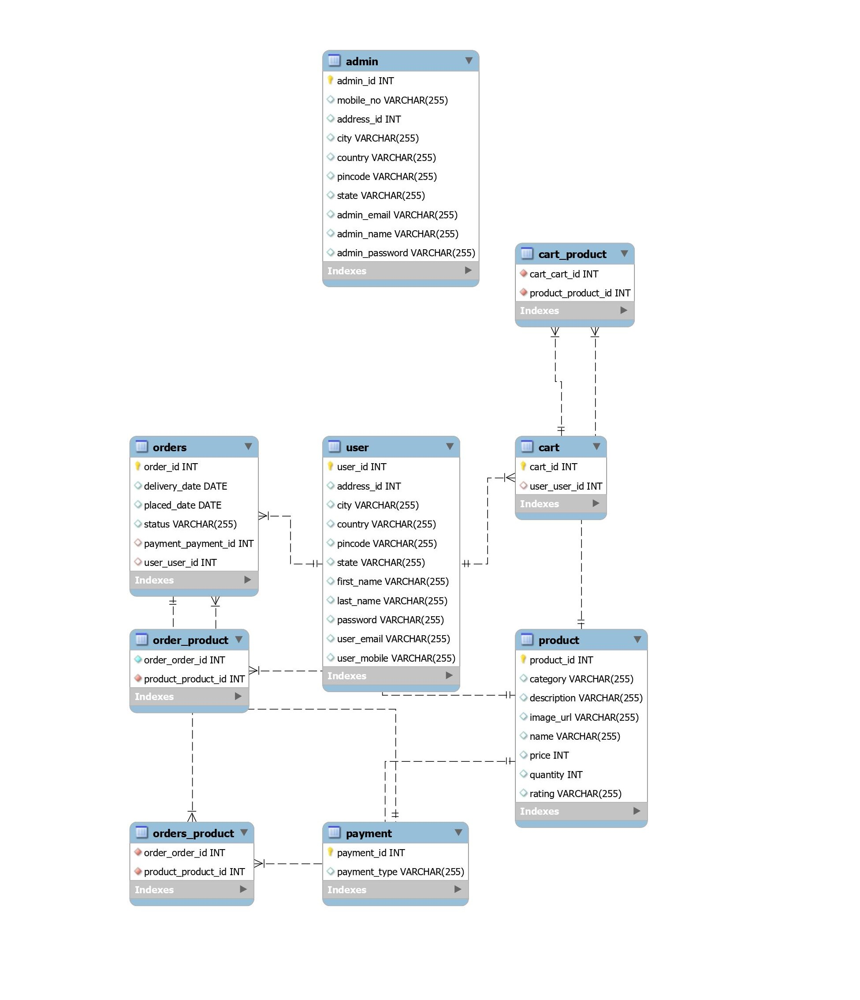
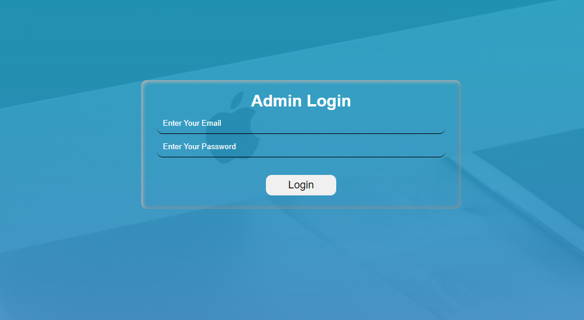
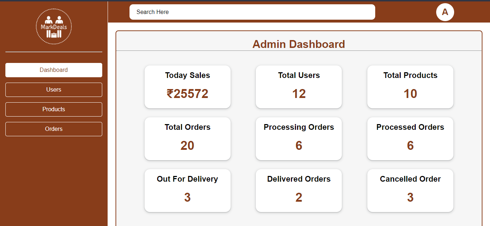
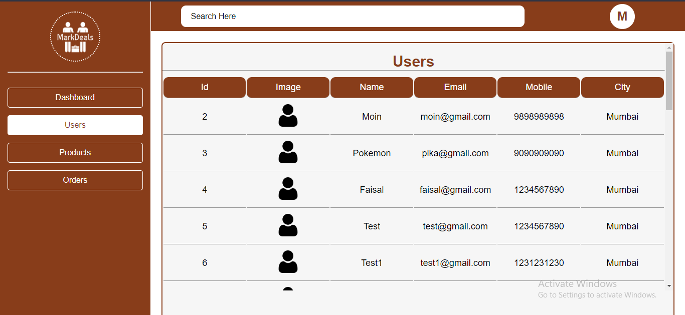
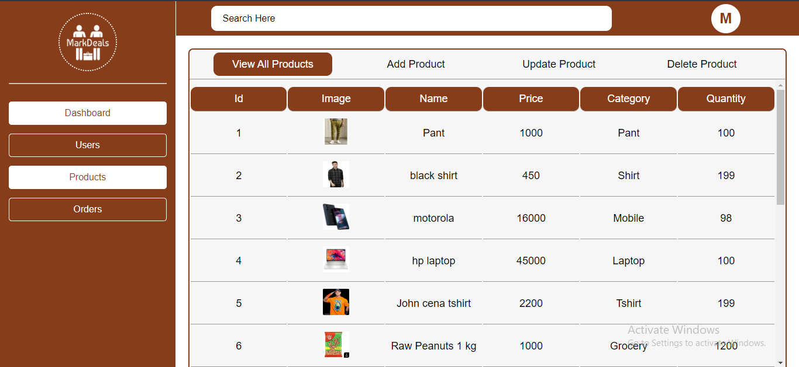
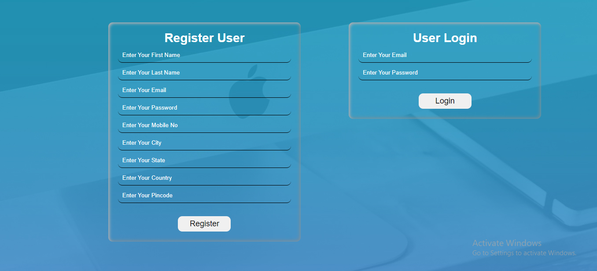
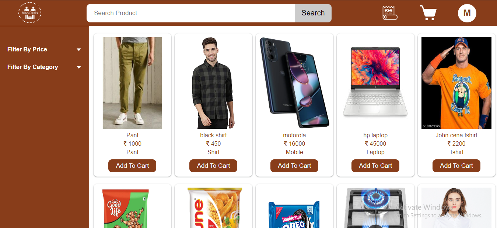
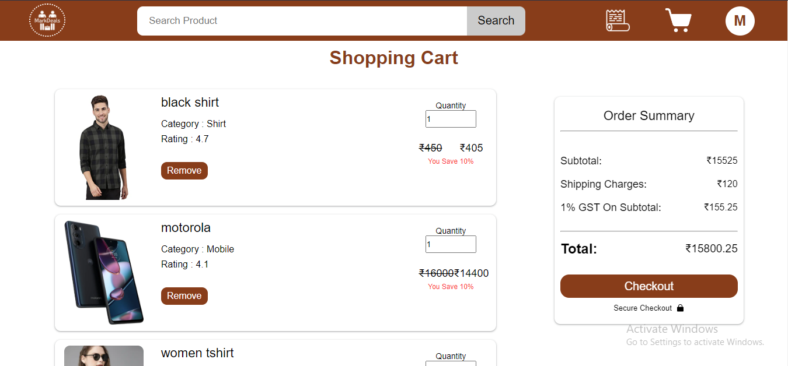
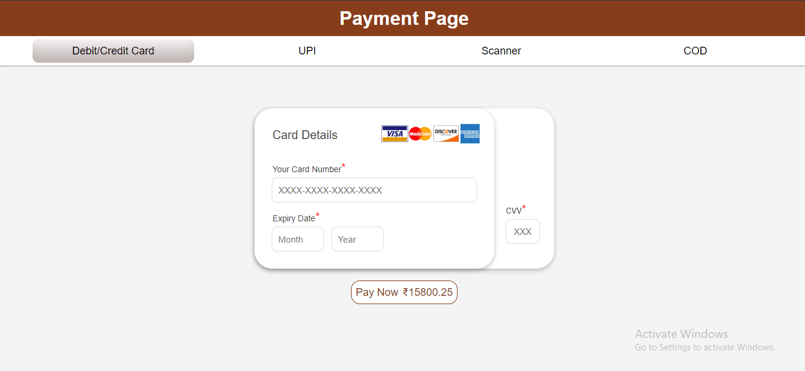
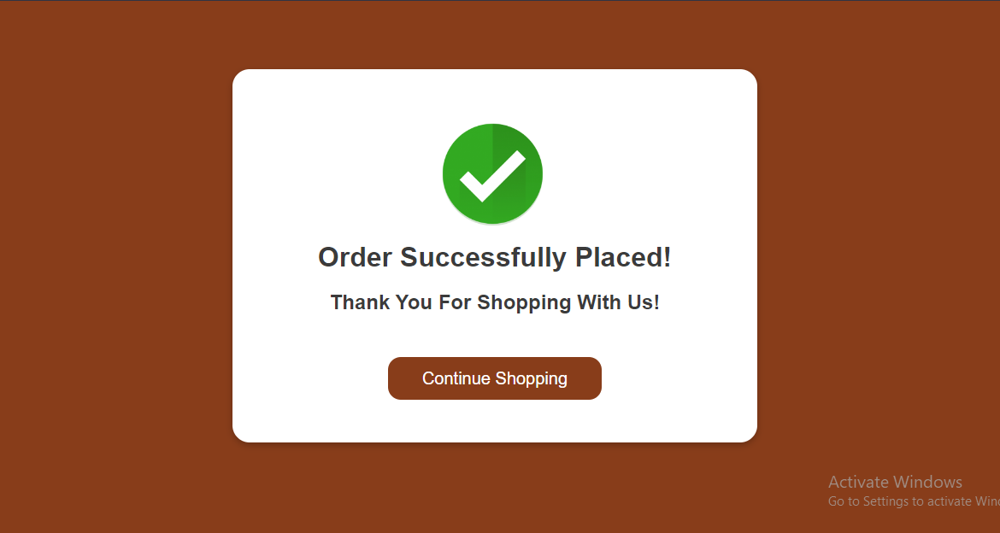

# MarkDeals

- The website has been built using Spring Boot, a popular Java-based framework, for its backend. For the frontend, the website uses HTML, CSS, and JavaScript, which are common languages used for building user interfaces on the web. The use of these technologies suggests that Markdeals is a modern and well-designed ecommerce platform that is capable of providing an optimal user experience for its customers.

## There are mainly 2 users : 
### 1.Admin 
### 2.User

## Index Page :

## Admin Side : 
### Login Form
- Username: admin@gmail.com
- Password: 12345678

### Dashboard
- It is pending...

### User Section
- View All Register Users

### Product Section
- View All Products
- Add product
- Update Product Price & Quantity
- Delete Product

### Order Section
- It is pending...

## User Side : 
### register & Login

### Product Page
- View All Products
- Search Product By Name
- Sort Products by Price (Low to high/high to low)
- Filter By Category (Pants,Shirts,T-shirt,Laptop,Mobile,Grocery,Home-Kitchen)
- Add To Cart Product

### Cart Page
- Remove Product
- Checkout Amount
- Increase/Decrease Quantity (Pending)

### Payment Page
- Card Payment(Card number should be of 16 digits, CVV = 786)
- UPI Payment (1234567890@ibl)
- Scan & Pay (Scan the barcode, You will get an otp)
- COD

### Success Page

## Tech Stack : 
- Java
- Spring Boot
- MySQL
- Spring Data JPA
- Hibernate
- Javascript
- CSS
- HTML
- Railway
- Swagger
